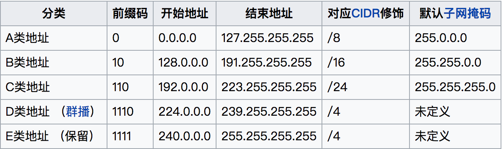
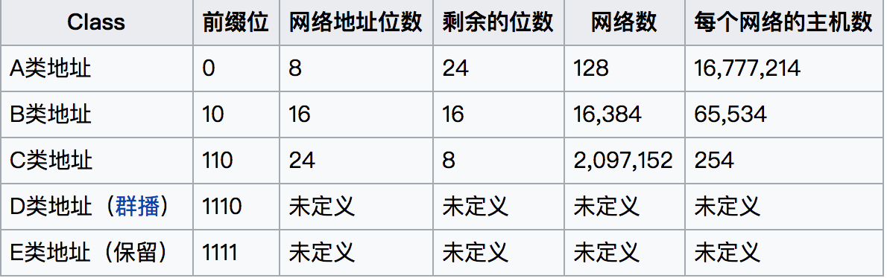

# 2020/9/24

## 1. 代码实践

### （1）LeetCode501 

给定一个有相同值的二叉搜索树（BST），找出 BST 中的所有众数（出现频率最高的元素）。

```c++
class Solution {

vector<int> num;
//中序遍历
void dfs(TreeNode* root){
    if(!root){
        return;
    }
    dfs(root->left);
    num.push_back(root->val);
    dfs(root->right);
}

vector<int> ans;
//找出众数
void findmost(){
    if(num.size()==0){
        return;
    }
    int base,cur,count,maxnum;
    base=cur=0;
    count=maxnum=0;
    for(;cur<num.size();){
        //不要忘记先检查下标是否越界
        while(cur<num.size()&&num[cur]==num[base]){
            count++;
            cur++;
        }
        if(count>maxnum){
            ans.clear();
            ans.push_back(num[base]);         
            maxnum=count;
        }
        else if (count==maxnum){
            ans.push_back(num[base]);
        }
        else{           
        }
        count=0;
        base=cur;       
    }
}

public:
    vector<int> findMode(TreeNode* root) {
        dfs(root);
        findmost();
        return ans;
    }
};
```

### （2）LeetCode547

班上有 N 名学生。其中有些人是朋友，有些则不是。他们的友谊具有是传递性。如果已知 A 是 B 的朋友，B 是 C 的朋友，那么我们可以认为 A 也是 C 的朋友。所谓的朋友圈，是指所有朋友的集合。

```c++
//熟悉的并查集
class Solution {
public:  
    int root[205];
    //查找根结点+路径压缩
    int findroot(int a){
        if(root[a]==a){
            return a;
        }
        else{
            root[a]=findroot(root[a]);
            return root[a];
        }
    }
    //合并结点
    void merge(int a,int b){
        int roota=findroot(a);
        int rootb=findroot(b);
        root[rootb]=roota;
    }
    
    int findCircleNum(vector<vector<int>>& M) {
        int N=M.size();
        int count=0;
        for(int i=0;i<N;i++){
            root[i]=i;
        }
        for(int i=0;i<N;i++){
            for(int j=i+1;j<N;j++){
                if(M[i][j]==1){
                    merge(i,j);
                }
            }
        }
        for(int i=0;i<N;i++){
            if(root[i]==i){
                count++;
            }
        }
        return count;
    }
};
```


## 2. 计算机基础知识

（1）IPv4地址分类





（2）RIP协议

RIP协议是一种内部网关协议（IGP），是一种动态路由选择协议，用于自治系统（AS）内的路由信息的传递。RIP协议基于距离矢量算法（DistanceVectorAlgorithms），使用“跳数”(即metric)来衡量到达目标地址的路由距离。距离就是通往目的站点所需经过的链路数，取值为1~15，数值16表示无穷大。

对于小型网络，RIP就所占带宽而言开销小，易于配置、管理和实现，并且RIP还在大量使用中。若采用RIP协议，其网络内部所经过的链路数不能超过15，==**这使得RIP协议不适于大型网络**==。

（3）ARP与RARP协议

APR协议：是解决同一个局域网上的主机或路由器的IP地址和硬件地址的映射问题。

RARP协议：解决同一个局域网上的主机或路由器的硬件地址和IP地址的映射问题。

（4）

在 IP 数据报中 , 片偏移字段表示本片数据在初始 IP 数据报数据区的位置 , 该偏移量应以==8个字节==为单位


## 3. 开源特训营

将个人仓库与上游的开源特训营仓库合并

提交每日学习笔记至小组仓库